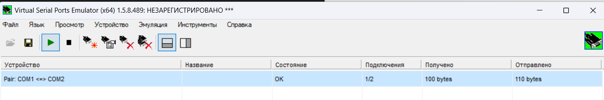
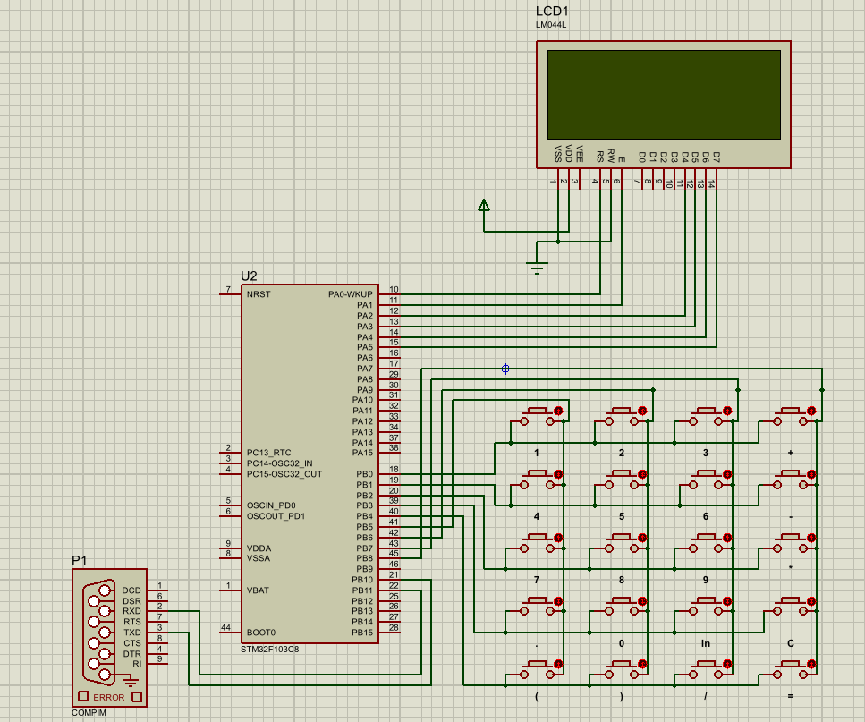
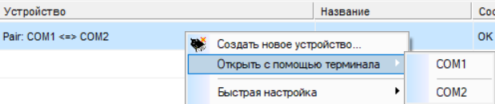
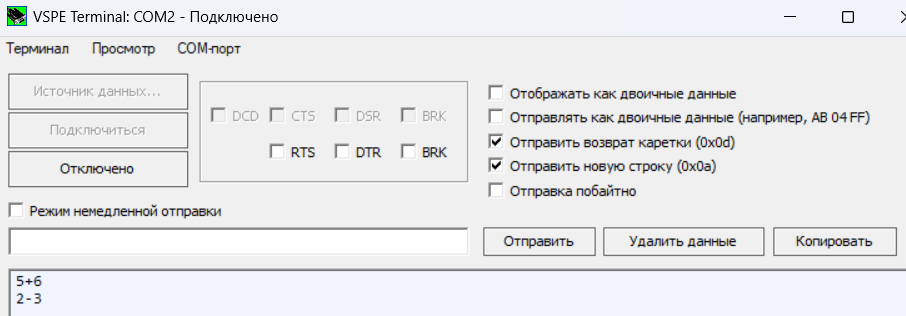

## Как запустить симуляцию Proteus->COM Port

1. Качаем и устанавливаем Proteus
Например этот должен подойти:
<https://rutracker.org/forum/viewtopic.php?t=6283860>

2. Качаем и устанавливаем VSPE (х64), незарегистрированной версии хватит
<https://eterlogic.com/products.vspe.html>

3. В VSPE делаем пару виртуальных портов, например COM1 <-> COM2

4. Открываем [проект](./proteus/proteus.pdsprj) в Proteus

Тыкаем на U2 два раза, указываем в поле Program File путь к [HEX-файлу](./keil/Objects/keil.hex)

OSC Frequency должна быть 8MHz, на всякий случай, пусть там и используется внутреннее тактирование вроде бы)

Тыкаем P1, Выбираем Physical Port - порт на который мы хотим передавать данные - если наша пара виртуальных портов COM1 <-> COM2, то выбираем один из них, скорее всего COM1

Оба Baud Rate ставим 9600, остальное оставляем по умолчанию

5. Запускаем симуляцию в Proteus кнопкой слева внизу, после ввода выражения калькулятор должен послать данные в COM порт. Проверить это и послать данные обратно можно с помощью VSPE:

Чтобы посылать данные в ответ, ставим галочки вот так, чтобы вставлялись переносы строки в конце данных:

И все, можно отвечать на запросы калькулятора и посылать ему произвольные данные для вывода на экран.

Осталось только написать сервер, который будет слушать COM2 (второй порт) и отвечать соответствующим образом. Главное - не забыть про переносы строки и бодрейт 9600.

